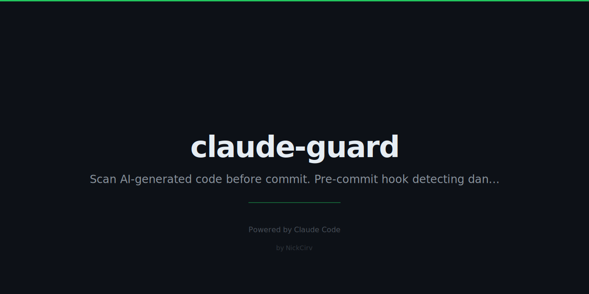

# claude-guard

Pre-commit safety net for AI-generated code. Catches dangerous patterns before they ship.



---

## Install

```sh
npm install -g claude-guard
# or use without installing:
npx claude-guard install
```

## Setup

Inside any git repo:

```sh
npx claude-guard install
```

That's it. Every `git commit` will run a scan automatically.

---

## Commands

| Command | What it does |
|---|---|
| `npx claude-guard install` | Install as git pre-commit hook |
| `npx claude-guard uninstall` | Remove the hook |
| `npx claude-guard scan` | Manually scan staged changes |
| `npx claude-guard scan --force` | Scan but don't block commit on RED |
| `npx claude-guard scan --json` | Output results as JSON |
| `npx claude-guard config` | Show current rules |
| `npx claude-guard config --edit` | Open config in $EDITOR |
| `npx claude-guard config --reset` | Reset to defaults |

---

## What It Catches

| Check | Severity | What it detects |
|---|---|---|
| **secrets** | RED (blocks) | AWS keys, Stripe keys, GitHub tokens, OpenAI/Anthropic keys, private key blocks, hardcoded passwords, DB URLs with credentials |
| **tests** | WARN | Deleted test files, decrease in test count |
| **errors** | WARN | Removed try/catch blocks, error handlers, .catch() chains |
| **size** | WARN | Single file with >500 lines changed |
| **deps** | WARN | New packages added to package.json / requirements.txt |
| **debug** | WARN | console.log, debugger, print(), var_dump, TODO/FIXME/HACK |
| **urls** | WARN | localhost, 127.0.0.1, local IPs in non-test/config files |

RED findings **block the commit**. WARN findings show but allow it through.

---

## Output

```
  Claude Guard  pre-commit scan
  ────────────────────────────────────────
  BLOCK  secrets
         src/api/client.js: [Stripe Secret Key] sk_live_...
   WARN  debug
         src/utils/format.js: [console.log] console.log('result:', data)
   WARN  deps
         package.json: 2 new deps added
           + lodash@4.17.21
           + axios@1.6.0
     OK  tests
     OK  errors
     OK  size
     OK  urls
  ────────────────────────────────────────
  1 blocker · 2 warnings · 42ms
  Fix blockers or run with --force to skip.
```

---

## Config

Create `.claude-guard.json` in your repo root (or run `npx claude-guard config --edit`):

```json
{
  "checks": {
    "secrets":  { "enabled": true,  "severity": "red"    },
    "tests":    { "enabled": true,  "severity": "yellow" },
    "errors":   { "enabled": true,  "severity": "yellow" },
    "size":     { "enabled": true,  "severity": "yellow", "maxLines": 500 },
    "deps":     { "enabled": true,  "severity": "yellow" },
    "debug":    { "enabled": true,  "severity": "yellow" },
    "urls":     { "enabled": true,  "severity": "yellow" }
  },
  "ignore": [
    "dist/",
    "fixtures/"
  ]
}
```

`ignore` patterns are matched against file paths. Any file containing the string is skipped across all checks.

---

## Bypass (emergency only)

```sh
git commit --no-verify
# or
npx claude-guard scan --force
```

---

## No AI, no network

claude-guard runs entirely locally. It uses `git diff --cached` and regex. No API calls, no telemetry, no config upload. Works offline.

---

## License

MIT
