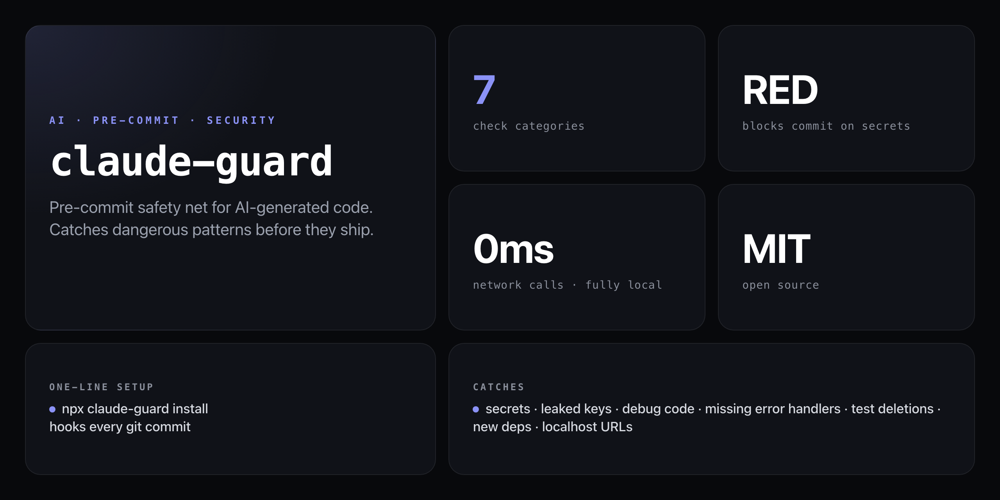

<div align="center">

**Hooks into every `git commit` and blocks dangerous patterns before they ship. Built for the age of AI-generated code.**


</div>

---

AI coding assistants write code fast — but they also confidently commit leaked keys, drop error handlers, delete test files, and leave `console.log` everywhere. `claude-guard` installs as a git pre-commit hook and runs 7 category checks on every staged diff, blocking on RED findings and warning on the rest.

```
  Claude Guard  pre-commit scan
  ────────────────────────────────────────
  BLOCK  secrets
         src/api/client.js: [Stripe Secret Key] sk_live_...
   WARN  debug
         src/utils/format.js: [console.log] console.log('result:', data)
   WARN  deps
         package.json: 2 new deps added
           + lodash@4.17.21
           + axios@1.6.0
     OK  tests
     OK  errors
     OK  size
     OK  urls
  ────────────────────────────────────────
  1 blocker · 2 warnings · 42ms
  Fix blockers or run with --force to skip.
```

## Install

No npm account needed — run straight from GitHub:

```bash
npx github:NickCirv/claude-guard install
```

That's it. Every subsequent `git commit` in the current repo will run a scan automatically.

## Usage

```bash
# install as pre-commit hook in the current repo
npx github:NickCirv/claude-guard install

# remove the hook
npx github:NickCirv/claude-guard uninstall

# manually scan staged changes
npx github:NickCirv/claude-guard scan

# scan but don't block even on RED
npx github:NickCirv/claude-guard scan --force

# output results as JSON
npx github:NickCirv/claude-guard scan --json

# show current rule config
npx github:NickCirv/claude-guard config

# open config in $EDITOR
npx github:NickCirv/claude-guard config --edit

# reset config to defaults
npx github:NickCirv/claude-guard config --reset
```

| Command | What it does |
|---------|-------------|
| `install` | Install as git pre-commit hook |
| `uninstall` | Remove the hook |
| `scan` | Manually scan staged changes |
| `scan --force` | Scan but don't block commit on RED |
| `scan --json` | Output results as JSON |
| `config` | Show current rules |
| `config --edit` | Open config in `$EDITOR` |
| `config --reset` | Reset to defaults |

## What it catches

| Check | Severity | What it detects |
|-------|----------|-----------------|
| **secrets** | RED (blocks) | AWS keys, Stripe keys, GitHub tokens, OpenAI/Anthropic keys, private key blocks, hardcoded passwords, DB URLs with credentials |
| **tests** | WARN | Deleted test files, decrease in test count |
| **errors** | WARN | Removed `try/catch` blocks, error handlers, `.catch()` chains |
| **size** | WARN | Single file with >500 lines changed |
| **deps** | WARN | New packages added to `package.json` / `requirements.txt` |
| **debug** | WARN | `console.log`, `debugger`, `print()`, `var_dump`, `TODO`/`FIXME`/`HACK` |
| **urls** | WARN | `localhost`, `127.0.0.1`, local IPs in non-test/config files |

RED findings **block the commit**. WARN findings show but allow it through.

## Config

Create `.claude-guard.json` in your repo root (or run `npx github:NickCirv/claude-guard config --edit`):

```json
{
  "checks": {
    "secrets":  { "enabled": true,  "severity": "red"    },
    "tests":    { "enabled": true,  "severity": "yellow" },
    "errors":   { "enabled": true,  "severity": "yellow" },
    "size":     { "enabled": true,  "severity": "yellow", "maxLines": 500 },
    "deps":     { "enabled": true,  "severity": "yellow" },
    "debug":    { "enabled": true,  "severity": "yellow" },
    "urls":     { "enabled": true,  "severity": "yellow" }
  },
  "ignore": [
    "dist/",
    "fixtures/"
  ]
}
```

`ignore` patterns are matched against file paths. Any file containing the string is skipped across all checks.

## Bypass (emergency only)

```bash
git commit --no-verify
# or
npx github:NickCirv/claude-guard scan --force
```

## What it is NOT

- **Not a replacement for a proper secrets manager.** `claude-guard` catches patterns that look like secrets in staged diffs — it doesn't prevent you from ever writing them. Pair with `.gitignore` hygiene and vault-backed env vars.
- **Not a static analysis tool.** It uses `git diff --cached` and regex against staged changes, not full AST analysis. It won't catch every possible vulnerability, and it can surface false positives. Tune with `ignore` patterns.
- **Not network-connected.** Everything runs locally via `git diff --cached`. No API calls, no telemetry, no config upload. Works fully offline.

---

<div align="center">
<sub>No network calls · Node 18+ · MIT · by <a href="https://github.com/NickCirv">NickCirv</a></sub>
</div>
